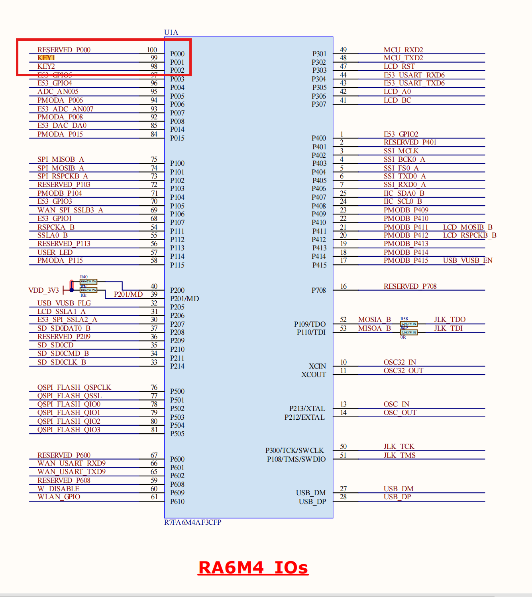

# 基于瑞萨电子 RA6M5 的智能导盲系统
## 系统介绍
这是一个基于`R7FA6M5BH3CFP`芯片的瑞萨开发板为主控制器，`ESP32-C3`作为网络模块的智能导盲系统雏形，通过OLED12864显示数据、TOF400C模块进行测距、AD+光敏电阻读取光照，并以此进行一系列对应操作（如发出声、光、语音提示）。并可以通过与ESP模块的联动，获取实时位置和发送电子邮件。

## 文件介绍
`\RA6M5` - 瑞萨芯片的主程序，使用e2 studio编译、J-Link下载 
- `\src` - 源代码
- `hal_entry.c` - 入口函数
- `mk_pinctrl` - GPIO兼容层
- `mk_rtt` - UART与JLink RTT Serial兼容层
- `OLED` - IIC OLED驱动程序
- `tof400c` - IIC TOF测距传感器驱动
- `\Debug` - 生成的二进制和中间文件
- `configure.xml` - 可视化配置工具

`\ESP32_C3_Arduino` - ESP32的C++代码，使用Arduino安装库后可以编译运行

## 更新
### V2.0 参加总决赛版
#### RA6M5代码方面
- 使用系统自带按键替代外置按键，适配中断输入，使用外部中断和系统定时器自动读取按键时间长度
- 适配`CPKIOT-RA6M5`主板的特色硬件外设，如板载LED、板载显示器接口等
- 修改部分外设连接方式，显示器接口对`SSD1306`OLED屏幕进行适配，可以直接进行连接
- 增加系统内置温度传感器支持，增加`MPU6050`姿态传感器支持
- 增设I2C API（文件位于`RA6M5/ra1/src/mk_i2c.h`
- 增加对`NMEA GPS`的支持，系统可从串口数据流解析标准格式的经纬度数据
- 代码结构、稳定性、可读性优化，一些bug的修复

#### ESP32代码方面
- 修复了定位失败率高的问题
- 增加了融合定位和位置信息文字解析。现在，在邮件中，可以直观的看到当前的位置了。
- 错误处理逻辑、回调函数等优化

## CPKIOT-RA6M5介绍与原理图
`CPKIOT-RA6M5`是瑞萨搭载`RA6M5`处理器的物联网验证板，虽然可以使用通用FSP进行开发，但其在官方FSP完整支持范围之外，引脚定义与`EK-RA6M5`存在差异。
文件中的`CPKIOT_RA6M5_sch.png`是该主板的原理图。

## 参见
**演示视频：** [bilibili](https://www.bilibili.com/video/BV1hxGgzbE6b)
**开发文档：** [个人主页](http://snowmiku-home.top/2025/08/15/post-2025816/)